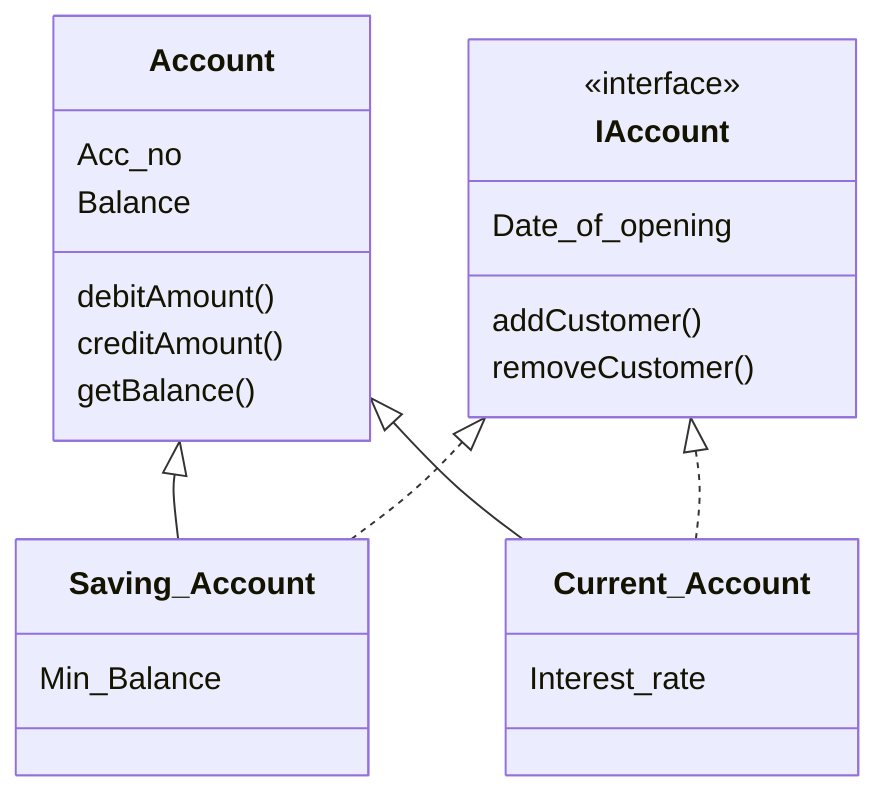

# Day 01 Tasks

# Q1

# Q2

1.	Create an object that takes `Admin` and `User` as a keys and have a values as `id` , `firstName` , `lastName`, `Password` and `age` 
2.	Create an object that has all the previous properties without `age` 
3.	Create an object that all the previous properties are optional and make them read-only
